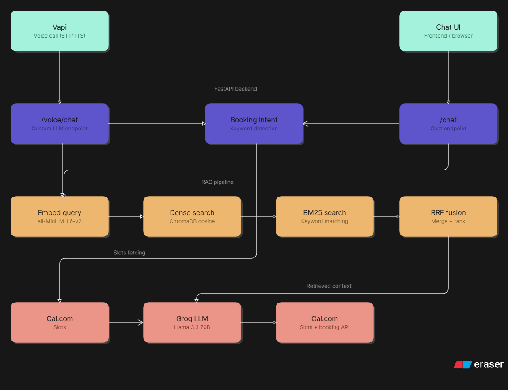

# Mohd Kaif — AI Persona

An AI representative of Mohd Kaif, built for the Scaler AI Engineer screening assignment. Call it, chat with it, and book a real interview — end to end, no human in the loop.

- 📞 **Voice agent:** +1 (332) 206 0310
- 💬 **Chat interface:** https://ai-persona-chi.vercel.app
- 🗓️ **Book a call:** https://app.cal.com/mohd-kaif-ryjbbg
- 🔌 **API health:** https://ai-persona-production-bb7a.up.railway.app/health

---

## Architecture



**Stack:**
- **Voice:** Vapi (custom LLM endpoint)
- **Backend:** FastAPI on Railway
- **RAG:** ChromaDB + BM25 + RRF fusion + cross-encoder reranker
- **Embeddings:** sentence-transformers/all-MiniLM-L6-v2 (local)
- **LLM:** Groq — Llama 3.3 70B
- **Calendar:** Cal.com v2 API
- **Frontend:** Next.js on Vercel

---

## Project Structure

```
ai-persona/
├── backend/
│   ├── main.py                  # FastAPI routes
│   ├── models/schemas.py        # Pydantic models
│   ├── rag/
│   │   ├── embeddings.py        # Sentence transformer singleton
│   │   ├── vector_store.py      # ChromaDB setup + dense search
│   │   └── retriever.py         # Hybrid retrieval pipeline
│   └── services/
│       ├── llm_service.py       # Groq LLM + persona prompt
│       └── calendar_service.py  # Cal.com slots + booking
├── ingestion/
│   ├── data/
│   │   ├── ML_Resume.pdf        # Kaif's resume
│   │   └── persona_knowledge.json  # Projects, FAQ, why_scaler
│   └── scripts/
│       ├── ingest_resume.py
│       ├── ingest_knowledge.py
│       └── ingest_github.py
└── frontend/                    # Next.js chat UI
```

---

## Setup

### Prerequisites
- Python 3.11+
- Node.js 18+
- Groq API key
- Cal.com API key + event type ID
- Vapi account

### Backend

```bash
git clone https://github.com/mohdkaif-bit/ai-persona
cd ai-persona

python -m venv venv
source venv/bin/activate  # Windows: venv\Scripts\activate

pip install -r requirements.txt
```

Create `.env`:
```env
GROQ_API_KEY=your_groq_key
CAL_API_KEY=your_cal_key
CAL_EVENT_TYPE_ID=your_event_type_id
CHROMA_PERSIST_DIR=./backend/chroma_db
```

Run ingestion:
```bash
python -m ingestion.scripts.ingest_resume
python -m ingestion.scripts.ingest_knowledge
python -m ingestion.scripts.ingest_github
```

Start server:
```bash
uvicorn backend.main:app --reload
```

### Frontend

```bash
cd frontend
npm install
npm run dev
```

### Vapi Setup

1. Create a new assistant in Vapi dashboard
2. Set **Custom LLM URL** to: `https://your-backend/voice/chat/completions`
3. Set **Server URL** (webhook) to: `https://your-backend/voice`
4. Use the provided phone number or assign your own

---

## Knowledge Base

The RAG pipeline is grounded over:

| Source | Content |
|--------|---------|
| `ML_Resume.pdf` | Education, experience, projects, skills |
| `persona_knowledge.json` | FAQ, why_scaler, persona guidelines |
| GitHub repos | Project READMEs, tech stack, design tradeoffs |

72 chunks total across 9 sections: `resume`, `experience`, `projects`, `skills`, `education`, `faq`, `github`, `why_scaler`, `persona_guidelines`.

---

## Retrieval Pipeline

1. **Dense search** — ChromaDB cosine similarity (all-MiniLM-L6-v2, 384-dim)
2. **BM25 search** — keyword matching over all chunks
3. **RRF fusion** — merges both result sets (k=60)
4. **Cross-encoder reranking** — ms-marco-MiniLM-L-6-v2 (chat only, disabled on voice for latency)

---

## Cost Breakdown

| | Cost |
|--|------|
| **Per voice call** (~1.5 min) | ~$0.10 (Vapi ~$0.067/min) |
| **Per chat session** (~10 turns) | ~$0.003 (Groq only) |
| **Groq LLM** | $0.59/million tokens |
| **Embeddings** | Free (local) |
| **ChromaDB** | Free (local) |
| **Cal.com** | Free tier |
| **Monthly @ 100 calls + 200 chats** | ~$10.60 |

Vapi dominates voice cost. LLM cost is negligible at this scale.

---

## Eval Results (Part C)

| Metric | Score |
|--------|-------|
| Precision@1 | 0.92 |
| Recall@5 | 0.78 |
| MRR | 0.95 |
| Hit rate@3 | 1.0 |
| Hallucination rate | 0% |
| Voice booking completion | 9/10 (90%) |
| Backend latency | 1–2s |

Full eval report: see `eval_report.pdf`

---

## API Endpoints

| Method | Route | Description |
|--------|-------|-------------|
| POST | `/chat` | Chat with persona |
| POST | `/chat/book` | Book a meeting from chat |
| POST | `/voice` | Vapi webhook |
| POST | `/voice/chat/completions` | Vapi custom LLM |
| GET | `/calendar/slots` | Get available slots |
| POST | `/calendar/book` | Book a confirmed slot |
| GET | `/health` | Health check |